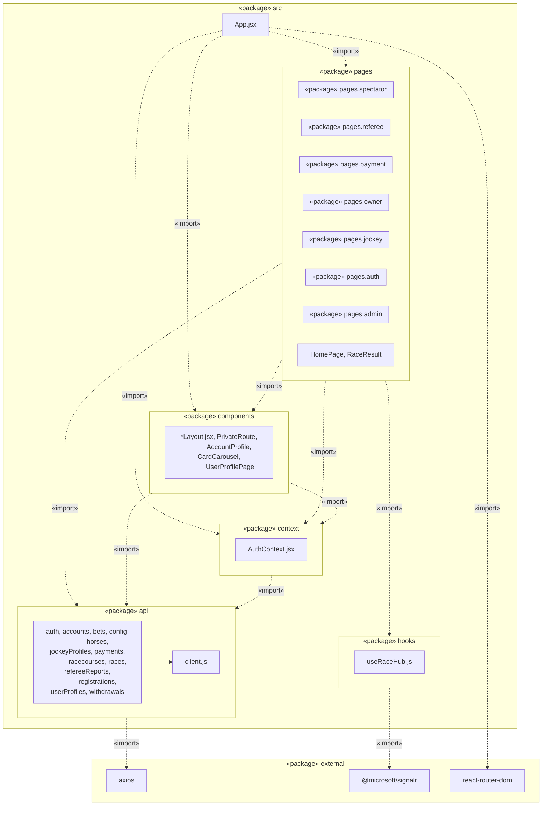

# Package Diagram (UML 2.0) — horse_racing_react

Sơ đồ gói (package diagram) mô tả kiến trúc thư mục `src/` và quan hệ phụ thuộc
(`<<import>>`) giữa các package. Mermaid chưa có type `packageDiagram` gốc, nên
sơ đồ được biểu diễn bằng `flowchart` với `subgraph` = package, mũi tên nét đứt
`..>` kèm stereotype `<<import>>` đúng ngữ nghĩa UML 2.0 package dependency.

## Ghi chú quan hệ giữa các package

| Từ | Đến | Stereotype | Ý nghĩa |
|---|---|---|---|
| `App.jsx` | `pages`, `components`, `context` | `<<import>>` | Khai báo route, bọc `AuthProvider`, dùng layout dùng chung |
| `pages.*` | `components` | `<<import>>` | Mỗi trang dùng `*Layout` (Spectator/Owner/Jockey/Dashboard) hoặc `AccountProfile`, `CardCarousel` |
| `pages.*` | `api` | `<<import>>` | Gọi các hàm REST (races, bets, payments, horses, ...) |
| `pages.*` | `context` | `<<import>>` | Dùng `useAuth()` để lấy user/role hiện tại |
| `pages.*` | `hooks` | `<<import>>` | Dùng `useRaceHub()` để nhận realtime update qua SignalR |
| `components` | `api`, `context` | `<<import>>` | `AccountProfile`/`UserProfilePage` gọi API hồ sơ và dùng `useAuth()` |
| `context` | `api` | `<<import>>` | `AuthContext` gọi `auth.js` (`login/logout/getMe`) |
| `api.*` | `api.client` | (internal) | Mọi module API dùng chung instance `axios` cấu hình sẵn |
| `api` | `axios` | `<<import>>` | Thư viện HTTP client |
| `hooks` | `@microsoft/signalr` | `<<import>>` | Kết nối realtime hub `/racehub` |

### Đặc điểm kiến trúc
- **Layered/flat theo domain**: `pages` chia theo *role* (admin, auth, jockey, owner, payment, referee, spectator) — phản ánh phân quyền ứng dụng (RBAC), không theo layer kỹ thuật.
- **`api` là tầng truy cập dữ liệu duy nhất**: không có `pages` hay `components` nào gọi `axios`/`fetch` trực tiếp — tất cả đi qua `api/*.js`, đảm bảo package `api` là điểm phụ thuộc chung (single dependency chokepoint) vào backend.
- **Không có cycle**: `api` và `hooks` không phụ thuộc ngược lại `pages`/`components`/`context` — dependency chỉ đi một chiều từ UI xuống hạ tầng, đúng nguyên tắc package diagram UML 2.0 (acyclic dependencies).
