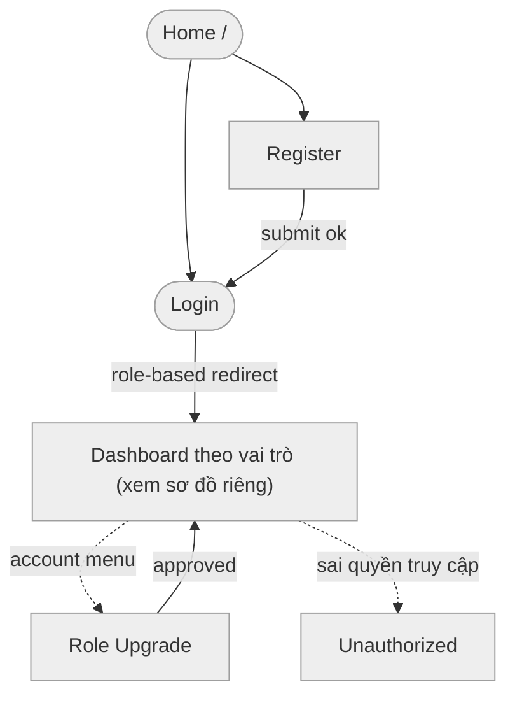
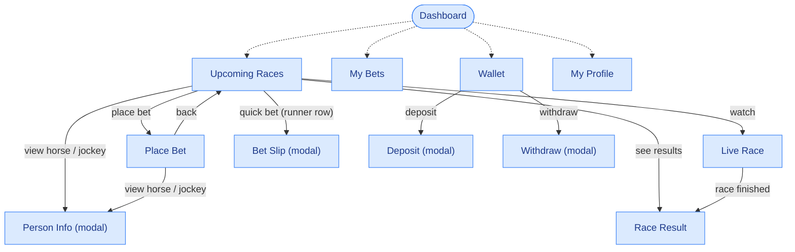
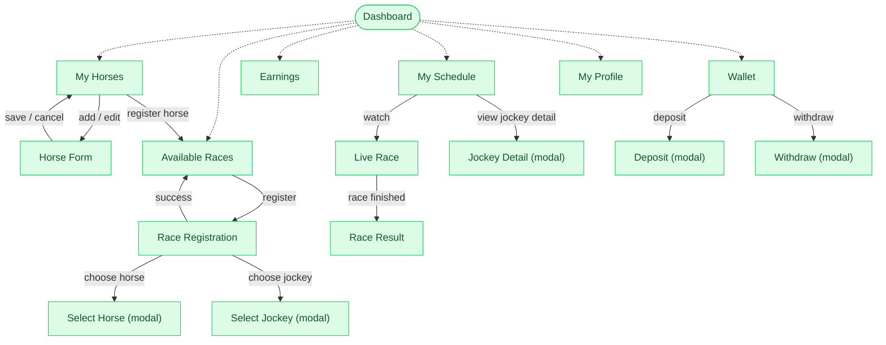
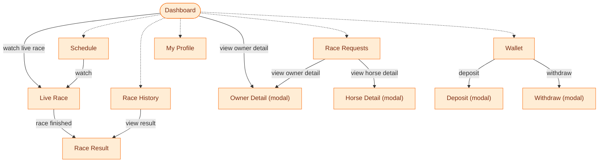
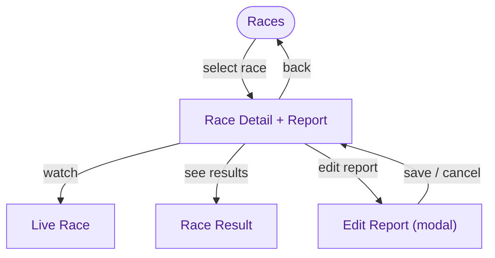

# Screen Flow — horse_racing_react

Sơ đồ luồng màn hình (screen flow) dựa trên route thật trong `App.jsx`, logic
điều hướng sau đăng nhập trong `Login.jsx`, menu sidebar của từng layout
(`SpectatorLayout`, `OwnerLayout`, `JockeyLayout`, `DashboardLayout`) và các
lệnh `navigate()` trong từng trang.

Tách riêng theo từng vai trò để mỗi sơ đồ gọn, dễ paste từng cái một vào draw.io
(**Insert → Advanced → Mermaid**).

Quy ước dùng chung cho mọi sơ đồ bên dưới:
- Hình thoi bo tròn (stadium) = **màn hình hub** (dashboard/danh sách gốc của vai trò).
- Hình chữ nhật bo góc = màn hình thường.
- Nét đứt xám, không nhãn = điều hướng qua **sidebar** (luôn có sẵn), chỉ vẽ **một
  chiều từ hub ra** — chiều ngược lại hiểu ngầm vì sidebar luôn hiện.
- Nét liền có nhãn = điều hướng theo **hành động cụ thể** (click nút, submit...).

---

## 1. Public / Auth

---

## 2. Spectator

---

## 3. Owner

---

## 4. Jockey

---

## 5. Referee

---

## 6. Admin

```mermaid
flowchart TB
    AD_DASH(["Dashboard"])
    AD_ACCOUNTS["Accounts"]
    AD_UPGRADEDETAIL["Upgrade Request Detail (modal)"]
    AD_RACES["Races"]
    AD_RACEFORM["Race Create/Edit (modal)"]
    AD_SETRESULT["Set Result (modal)"]
    AD_COLLECTPOOL["Collect Pool (modal)"]
    AD_RACECOURSES["Racecourses"]
    AD_RACECOURSEFORM["Racecourse Create/Edit (modal)"]
    AD_REGISTRATIONS["Registrations"]
    AD_REGDETAIL["Registration Detail"]
    AD_REFEREES["Referee Assignment"]
    AD_REFEREE_REPORTS["Referee Reports"]
    AD_BETS["Bets"]
    AD_BETDETAIL["Bet Detail"]
    AD_TAKEOUT["Takeout Ledger"]
    AD_WITHDRAWALS["Withdrawals"]
    AD_PAYMENTS["Payments"]
    AD_CONFIG["Configuration"]
    AD_CONFIGFORM["Config Create/Edit (modal)"]

    AD_DASH -.-> AD_ACCOUNTS
    AD_DASH -.-> AD_RACES
    AD_DASH -.-> AD_RACECOURSES
    AD_DASH -.-> AD_REGISTRATIONS
    AD_DASH -.-> AD_REFEREES
    AD_DASH -.-> AD_REFEREE_REPORTS
    AD_DASH -.-> AD_BETS
    AD_DASH -.-> AD_TAKEOUT
    AD_DASH -.-> AD_WITHDRAWALS
    AD_DASH -.-> AD_PAYMENTS
    AD_DASH -.-> AD_CONFIG

    AD_BETS -->|"select race"| AD_BETDETAIL
    AD_RACES -->|"prize preview"| AD_BETDETAIL
    AD_ACCOUNTS -->|"view details"| AD_UPGRADEDETAIL
    AD_UPGRADEDETAIL -->|"close"| AD_ACCOUNTS
    AD_REGISTRATIONS -->|"select race"| AD_REGDETAIL
    AD_REGDETAIL -->|"back"| AD_REGISTRATIONS

    AD_RACES -->|"add / edit"| AD_RACEFORM
    AD_RACEFORM -->|"save / cancel"| AD_RACES
    AD_RACES -->|"set result"| AD_SETRESULT
    AD_SETRESULT -->|"confirm / cancel"| AD_RACES
    AD_RACES -->|"collect pool"| AD_COLLECTPOOL
    AD_COLLECTPOOL -->|"confirm / cancel"| AD_RACES

    AD_RACECOURSES -->|"add / edit"| AD_RACECOURSEFORM
    AD_RACECOURSEFORM -->|"save / cancel"| AD_RACECOURSES

    AD_CONFIG -->|"add / edit"| AD_CONFIGFORM
    AD_CONFIGFORM -->|"save / cancel"| AD_CONFIG

    classDef admin fill:#fee2e2,stroke:#ef4444,color:#7f1d1d
    class AD_DASH,AD_ACCOUNTS,AD_UPGRADEDETAIL,AD_RACES,AD_RACEFORM,AD_SETRESULT,AD_COLLECTPOOL,AD_RACECOURSES,AD_RACECOURSEFORM,AD_REGISTRATIONS,AD_REGDETAIL,AD_REFEREES,AD_REFEREE_REPORTS,AD_BETS,AD_BETDETAIL,AD_TAKEOUT,AD_WITHDRAWALS,AD_PAYMENTS,AD_CONFIG,AD_CONFIGFORM admin
```

---

## Danh sách route theo vai trò

| Vai trò | Path | Trang |
|---|---|---|
| Public | `/` | HomePage |
| Public | `/login` | Login |
| Public | `/register` | Register |
| Any (auth) | `/upgrade` | RoleUpgrade |
| Any (auth) | `/payment/cancel` | Payment Cancel |
| Spectator | `/spectator/dashboard` | Dashboard |
| Spectator | `/spectator/races` | Upcoming Races |
| Spectator | `/spectator/races/:raceId/bet` | Place Bet |
| Spectator | `/spectator/races/:raceId/live` | Live Race |
| Spectator | `/spectator/races/:raceId/results` | Race Result |
| Spectator | `/spectator/bets` | My Bets |
| Spectator | `/spectator/wallet` | Wallet |
| Spectator | `/spectator/profile` | My Profile |
| Owner | `/owner/dashboard` | Dashboard |
| Owner | `/owner/horses`, `/owner/horses/new`, `/owner/horses/:id/edit` | My Horses / Horse Form |
| Owner | `/owner/schedule` | My Schedule |
| Owner | `/owner/races`, `/owner/races/:raceId/register` | Available Races / Registration |
| Owner | `/owner/races/:raceId/live`, `/results` | Live Race / Result |
| Owner | `/owner/earnings` | Earnings |
| Owner | `/owner/wallet` | Wallet |
| Owner | `/owner/profile` | My Profile |
| Jockey | `/jockey/dashboard` | Dashboard |
| Jockey | `/jockey/requests` | Race Requests |
| Jockey | `/jockey/schedule` | Schedule |
| Jockey | `/jockey/history` | Race History |
| Jockey | `/jockey/wallet` | Wallet |
| Jockey | `/jockey/profile` | My Profile |
| Jockey | `/jockey/races/:raceId/live`, `/results` | Live Race / Result |
| Referee | `/referee/races` | Races |
| Referee | `/referee/races/:raceId` | Race Detail (nộp report) |
| Referee | `/referee/races/:raceId/live`, `/results` | Live Race / Result |
| Admin | `/admin/dashboard` ... `/admin/config` | 13 trang quản trị |

**Ghi chú:** file `src/pages/referee/ReportSubmission.jsx` tồn tại nhưng **không có route** nào trong `App.jsx` trỏ tới — việc nộp report thực tế nằm trong `RaceDetail.jsx`. Đây có thể là file mồ côi (dead code), không đưa vào sơ đồ.
